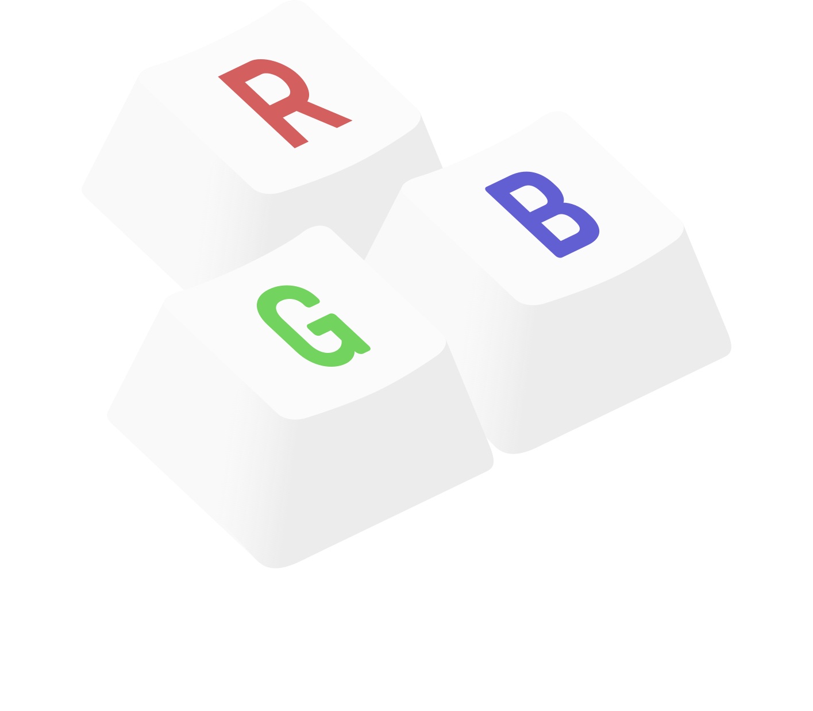

=======================
|logo| keyleds |codacy|
=======================

Userspace service for Logitech keyboards with per-key RGB LEDs.

Quick links:

* `installing`_
* `documentation`_
* `sample configuration`_
* `issue tracker`_

This project supports all Logitech RGB leds USB keyboards, on all keyboard layouts.

Features
--------

* Flexible per-application RGB settings with `key groups`_.
* Reacts to window title changes, enabling switching profiles based on
  current webpage in browser or open file extension in editors.
* Improved, fully configurable animation plugins:

  - **Keypress feedback** effect.
  - **Fixed** colors.
  - **Breathing** effect.
  - **Wave** effect.
  - **Stars** effect.
  - **Idle dimming** effect.

* **Create your own effects** with the `LUA engine`_.
* Several plugins can be active at once, and composited with **alpha blending** to
  build complex effects.

* Plays nicely with systemd sessions, detecting user switches so multiple users can
  use the service without them fighting over keyboard control.
* Supports multipe keyboards with different configuration per keyboard.

And a few goodies:

* **DBUS Interface** for scripting and richer interactions with your LUA effects.
* **Command-line tool** for your scripting needs and extended configuration
  (set game-mode keys, change report rate, see USB exchanges…).

----

Feedback, feature ideas, pull requests are welcome!

.. _installing: https://github.com/spectras/keyleds/wiki/Installing
.. _documentation: https://github.com/spectras/keyleds/wiki
.. _sample configuration: https://github.com/spectras/keyleds/blob/master/keyledsd/keyledsd.conf.sample
.. _issue tracker: https://github.com/spectras/keyleds/issues
.. _key groups: https://github.com/spectras/keyleds/wiki/Key-Group
.. _LUA engine: https://github.com/spectras/keyleds/wiki/LUA-Introduction

.. |codacy| image:: https://api.codacy.com/project/badge/Grade/c0737da40c404e9d9b675197a3567048
   :target: https://www.codacy.com/project/spectras/keyleds/dashboard?utm_source=github.com&amp;utm_medium=referral&amp;utm_content=spectras/keyleds&amp;utm_campaign=Badge_Grade_Dashboard
